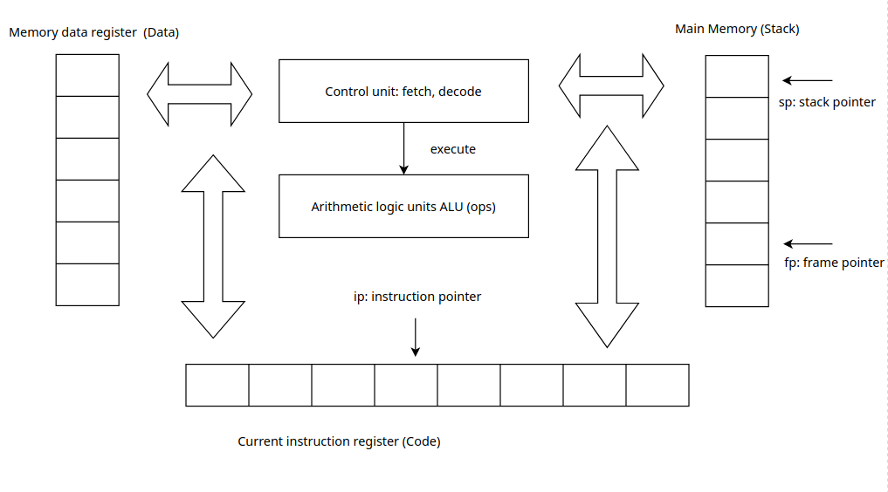

# Architecture globale

Notre langage se définit en trois instructions pour le début à savoir:
déclarer une variable, assigner une valeur à une variable et afficher une
valeur. Noter que nous étendrons les fonctionnalités progressivement selon 
notre avancement sur ce projet.

Ci-dessous la spécification de la syntaxe grammaire en lex:

#### `id: [a-zA-Z_][a-zA-Z0-9_]*`
#### `type: 'string' | 'number' | 'boolean'`
#### `declaration: {id} ':' {type} ';'`
#### `number: [0-9]+`
#### `expression: {id} | {number}`
#### `assignment: {id} '=' {expression} ';'`
#### `print: 'print' {expression} ';'`

Ce qui permet d'avoir un exemple de programme valide comme ci-dessous:


```
x: number;
x = 1250;
print x;
print 1;

```

## Lexer

Lorsque le compilateur Ba reçoit une séquence, il est incapable de reconnaître
ne se reste qu'un atome. C'est là qu'intervient le lexer, il nous permet de savoir
dans une séquence, que par exemple que la chaîne number est un type. Dans la version
actuelle, les différents motifs sont:

- *TOKEN_ID*
- *TOKEN_TYPE*
- *TOKEN_COLON*
- *TOKEN_SEMICOLON*
- *TOKEN_ASSIGNMENT*
- *TOKEN_NUMBER*
- *TOKEN_PRINT*

Le design pattern utilisé pour implémenter le lexer est la pile (liste chaînée).
Il permet de renvoyer une liste de motifs comme par exemple lorsqu'un programme 
est `x: number;` => `[TOKEN_SEMICOLON, TOKEN_TYPE, TOKEN_COLON, TOKEN_ID]`.
L'avantage d'utiliser la liste chaînée à la place des tableaux est que la taille
d'une liste augmente à chaque fois qu'il est nécessaire autant qu'il y'a de la mémoire
sur l'ordinateur cible.

Les fonctions classiques de la pile sont push, pop et peek. Le push dans notre programme
est *`add_token`* dont l'algorithme:

```
- Créer l'object à stocker
- Créer un nouvel élément de la pile lequel stock le nouvel objet.
- Le précédent du nouvel élément pointe sur la pile.
- La pile pointe sur le nouvel élément créé.

```

Ensuite la fonction pop équivalente à *`pop_token`*:

```
- Récupérer l'objet en haut de la pile c'est à dire l'actuel.
- Détruire l'élément actuel
- Renvoyer l'objet.

```

La fonction peek équivalente à *`peek_token`*:

```
- Renvoyer l'objet actuel du haut de la pile.

```

## Parser

Une fois que nous somme capable d'identifier les différents types de motifs,
il est aisé de construire notre abre de syntaxe abstraite. Il s'agit simplement
d'une représentation de la structure du programme à compiler. En d'autre de savoir
l'ensemble des motifs que représente par exemple une déclaration.
**Exemple**: `x: number;` =>

	    AST
	     |
	Declaration
	    /\
	   /  \
	  /    \
	 Id   Type

Dans cette section, le compilateur **BA** commence à émettre des erreurs lorsque la syntaxe est
grammairement incorrecte. Par exemple lorqu'un point virgule est omis, une erreur est affichée mais
n'empèche que Ba continue d'analyser le programme jusqu'à la fin.
L'approche appliquée pour parser le programme est que chaque grammaire dans la spécification du langage
est attribuée à une structure de donnée considérée comme un noeud. Les noeuds sont ainsi construits
lorsqu'ils sont conforme à la grammaire du langage.
Noter l'utilisation de l'AST pour les autres fonctionnalités à savoir par exemple l'affichage de l'AST, le binder
ou autres peuvent devenir rapidement bordellique. Afin d'eviter ça, nous utilisons le design pattern **visitor**.

Le visitor pattern permet de garder les structures de données simple et évite de rajouter de nouveaux membres à celles-ci 
lorsqu'il faut implémenter une nouvelle fonctionnalité. Chaque nouvelle opération se fait depuis un visitor et le
noeud ne fera qu'accepter celle-ci. Je donnerai plus d"explication dans les prochaines tutoriels.

## Binder

Il permet de vérifier la sémantique du programme donné en entrée. Ceci consiste à vérifier si une variable est déclarée avant d'être utilisée, la redéclaration de variable, l'adéquation de type lorsqu'une variable est assignée à une expression ainsi que la portée
de variable. Dans cette sèrie de tutoriel, nous couvrons pas la portée des variables mais nous prévoyons la fonctionnalité à
savoir le cadre de pile (stack frame). De ce fait la portée de variable pourra être vérifier simplement en testant si une variable
est présent dans la trame (frame) actuelle. Dans ce cas, la variable est dite locale. Si la variable n'existe pas dans la trame de donnée actuelle mais existe dans les trames précedentes alors elle est dit globale. Dans les autres cas, une erreur est déclenchée
pour dire que la variable n'est pas déclarée.

- Une stackframe est simplement une liste chainée (pile) dont l'élément est une dataframe.
- Une dataframe est également une liste chaînée dont les éléments sont:
    * un identifiant (id)
    * un type
    * une adresse

En résumé une stackframe est une liste à deux dimensions dont la première dimension agissant comme dataframe est la liste de variables
locales comme par exemple d'une fonction. La deuxième dimension consite à limiter la visibilité des variables. Si on considère
que chaque dataframe correspond à la liste des variables locales d'une fonction (ca peut être une classe, un module ...) alors une frame
représente une fonction.

```

		__________________________________________________________________________
		|			frame			|	prev	
		|	 ________________________________	|
		|	|  id	    	|			|
 Stacframe	| 	|  type		|	prev		|	..........
		| data	|  addr		|	.....		|
		| frame	|		|			|
		|	|_______________|_________________	|
		|_______________________________________________|_________________________


```

## Compiler

Le compilateur consiste en la génération du bytecode du programme donné en entrée. Un bytecode est une sèrie d'instructions nommées en générale opcode. Ceci ressemble au langage assembleur dont chaque instruction peut avoir ou pas d'arguments. Ainsi, dans cette sèrie tutoriel, nous aurons les opcodes suivantes:

| Opcodes  | Opname        |  Oparg 			|
|:--------:|:-------------:|:--------------------------:|
| 0x00	   | NOP	   | NONE   			|
| 0x01	   | ILOAD_CONST   | VALUE NUMBER TO LOAD	|
| 0x02     | ILOAD_VAR	   | VALUE REFERENCE TO LOAD	|
| 0x03	   | ISTORE	   | REFERENCE TO SET		|
| 0x04	   | IECHO	   | NONE			|
| 0x05     | HALT	   | NONE			|


Un bytecode est composé d'un header et d'un body. Nous verrons le header si besoin lorsque nous attaquerons la virtuelle machine mais pour avoir une idée, elle peut contenir des métadata sur le code source, la taille de la pile de la vm, un mot magique pour vérifier l'intégrite du bytecode  ....
Le body sera une suite d'un opcode en 2 octets, la taille en octet de l'argument de l'opcode en 2 octets et l'argument.
**Exemple**:
 `x = 1;`  => se décompose en deux instructions

ILOAD_CONST	1  => '01011' => ajoute un nouvel élément en haut de la pile
ISTORE		0  => '03010' => stocke le dernier élément de la pile à l'adresse donnée en argument.

Le bytecode body sera donc: '0101103010'.

```
x: number;
x = 1;
print x;
```

ILOAD_VAR	0
ILOAD_CONST	1
ISTORE		0
ILOAD_VAR	0
IECHO

bytecode body sera: '020100101101010020100500'

## VM: virtual machine

Elle interprète le bytecode et execute chaque opération définie par celui-ci comme le fait de charger une variable dans sa pile ou de stocker une valeur dans sa mémoire. Une virtuelle machine est comme un ordinateur. Elle a donc:

- CPU
- Main memory (stack): une pile de mémoire comme un cache lequel est directement utilisé par l'ALU.
- Current instruction register (Code): la liste des instructions
- Memory data register (Data): des données tels que des variables et autres informations
- Instruction pointer: un indice qui pointe l'instruction actuelle a exécuter
- Stack pointer: un indice qui pointe sur l'élement actuel disponible de la pile
- Frame pointer: un indice qui pointe sur la portée des éléments disponible

Un schéma pour illustrer tout ceci:



De ce fait chaque opcode du bytecode donné en entrée aura une opération correspondante qui s'exécuteront séquentiellement. Notez que tant que l'opcode HALT n'est pas rencontré, la vm s'éxécute à l'infini.

